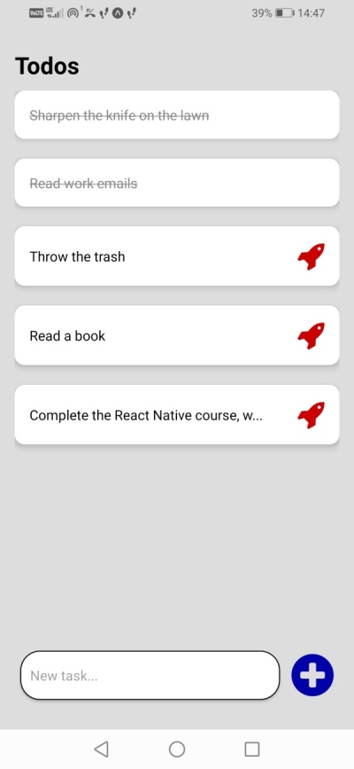
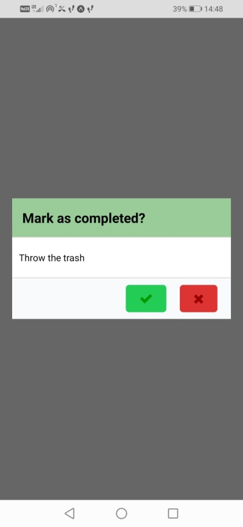

# React Native Todo List

Simple React Native app to manage todos.

## Technologies and libraries

* [React Native](https://reactnative.dev/)
* [React Native Vector Icons](https://github.com/oblador/react-native-vector-icons)

## Running

```
	$ ./npm start
```

***

# React Native Todo List

Oparta na React Natice aplikacja do zarządzania prostymi zadaniami.

## Technologie i biblioteki

* [React Native](https://reactnative.dev/)
* [React Native Vector Icons](https://github.com/oblador/react-native-vector-icons)

## Uruchamianie

```
	$ ./npm start
```
